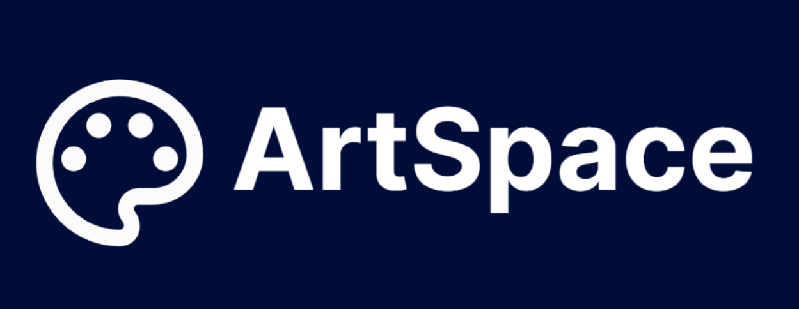

<div align="center" width="100%">
  
</div>

---
## **APLICACIÓN WEB DE PUNTO DE VENTAS DE ILUSTRACIONES DIGITALES PARA ARTSPACE**

### Desarrollo de la aplicación web ArtSpace
El proyecto "Aplicación web de punto de venta de ilustraciones digitales para ArtSpace" tiene como objetivo brindar espacios de comercialización para que los artistas pueden exhibir sus productos y los internautas puedan adquirir ilustraciones digitales de calidad.

### Herramientas, Frameworks, Lenguaje de programación:
            

### Despliegue :globe_with_meridians:

Se puede acceder al despliegue en el siguiente enlace: [ArtSpace](https://king-prawn-app-qnt6y.ondigitalocean.app/)

### Manual de Usuario :notebook:

El video que muestra las funciones del sistema se puede encontrar en: [Manual de usuario](https://youtu.be/EUrQTQ31)

### Instalación :gear:

#### Instalación de herramientas :hammer_and_wrench:

- Instalación de [Visual Studio Code](https://code.visualstudio.com/) 
- Instalación de [XAMPP](https://www.apachefriends.org/index.html), elegir la versión PHP 8.1.25 o superior para que no genere errores con Laravel 10. 
- Instalación de [Node.js](https://nodejs.org/)
- Instalación de [Git](https://git-scm.com/) (para clonar el proyecto)
- Instalación de [Composer](https://getcomposer.org/download/) 

Para instalar el proyecto localmente, es necesario:

1. Clonar el repositorio usando git con el comando:
```
git clone https://github.com/Robert9507/Deploy-ArtSpace.git
```

2. Ir a la carpeta donde se encuentra el proyecto e instalar el manejador de paquetes de JavaScript:
```
npm install
```

3. Instalar dependencias de Composer: 
```
composer global require laravel/installe
```

4. Copiar el archivo de configuración .env:
```
cp .env.example .env
```

6. Ejecultar XAMMP e inciar MySQL, en el panel de control de phpMyAdmin crear una nueva base de datos. 

7. Configurar las credenciales de la base de datos en el archivo .env: 
 DB_HOST, DB_PORT, DB_DATABASE, DB_USERNAME, y DB_PASSWORD.

8. Crear un enlace simbólico entre el directorio de almacenamiento y el directorio público:
```
php artisan storage:link
```

9. Ejecutar migraciones del proyecto:
```
php artisan migrate --seed
```

### Uso 

Para ejecutar al proyecto de deben seguir los siguientes pasos:

1. Ejecutar el administrador de paquetes de Node.js:
```
npm run dev
```

2. Iniciar el servidor de desarrollo local:
```
php artisan serve
```

3. Acceder a la dirección [localhost:8000](http://127.0.0.1:8000/) desde un navegador web.

